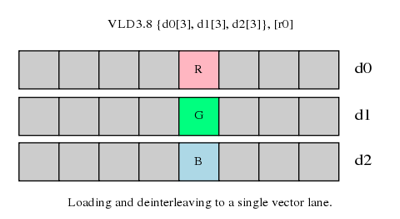
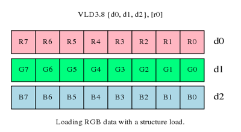
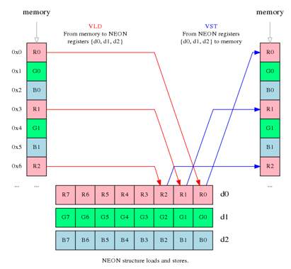
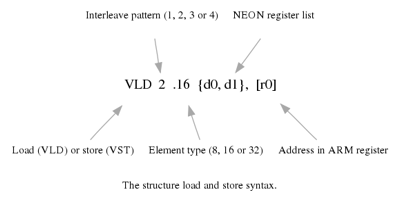
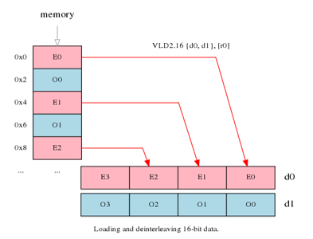
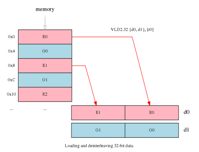
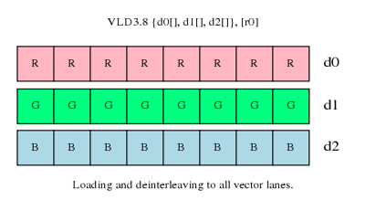

## 前言
本文翻译自：[Coding for NEON - Part 1: Load and Stores](https://community.arm.com/groups/processors/blog/2010/03/17/coding-for-neon--part-1-load-and-stores "Coding for NEON - Part 1: Load and Stores")

## 导读
> ARM's NEON technology is a 64/128-bit hybrid SIMD architecture designed to accelerate the performance of multimedia and signal processing applications, including video encoding and decoding, audio encoding and decoding, 3D graphics, speech and image processing.  

ARM NEON技术是一种64/128位混合的SIMD架构。NEON主要用于加速多媒体以及信号处理，如：视频编解码，音频编解码，3D图形，声音和图像处理等。  

> This is the first part of a series of posts on how to write SIMD code for NEON using assembly language. The series will cover getting started with NEON, using it efficiently, and later, hints and tips for more experienced coders. We will begin by looking at memory operations, and how to use the flexible load and store with permute instructions.  

本文是关于如何编写NEON指令系列博客的开篇。该系列博客将覆盖如何开始写NEON指令，优化NEON指令，以及各种优化NEON程序的tips等技术。这篇文章将教你基本的NEON内存操作指令，以及如何利用混排指令灵活的加载和存储数据。  

## 示例(An Example)  

> We will start with a concrete example. You have a 24-bit RGB image, where the pixels are arranged in memory as R, G, B, R, G, B... You want to perform a simple image processing operation, like switching the red and blue channels. How can you do this efficiently using NEON?  

我们首先来看一个具体的例子。假设你有一张RGB24的图像，像素存储格式为：R,G,B,R,G,B...，你希望执行一种简单的图像处理操作如交换红蓝通道。那么该利用NEON来高效地完成这个操作呢？  

> Using a load that pulls RGB data linearly from memory into registers makes the red/blue swap awkward.  

采用简单的线性load指令从内存中复制到寄存器里面完成这个处理将会很麻烦。  

> Code to swap channels based on this input is not going to be elegant - masks, shifting, combining. It is unlikely to be efficient.  

通过线性load然后去做分割、移位、合并这种方法去交换通道很麻烦，并且效率低下。  

> NEON provides structure load and store instructions to help in these situations. They pull in data from memory and simultaneously separate values into different registers. For this example, you can use VLD3 to split up red, green and blue as they are loaded.  

NEON提供了结构化的加载和存储指令以应对这种场景。这些结构化指令能在将从内存中加载的同时直接分离到不同的寄存器中。比如，你可以利用VLD3指令去完成加载图像像素以及同时分离出红绿蓝通道。  

> Now switch the red and blue registers (VSWP d0, d2) and write the data back to memory, with reinterleaving, using the similarly named VST3 store instruction.  

然后，交换红蓝寄存器（VSWP d0，d2），接着用名字差不多的存储指令VST3将数据写回到内存中。  

## 正文(The Details)    

### 概论(Overview)  

> NEON structure loads read data from memory into 64-bit NEON registers, with optional deinterleaving. Stores work similarly, reinterleaving data from registers before writing it to memory.   

NEON结构化加载指令从内存中读取数据进入64位NEON寄存器，可以选择是否交错读取。同样的，存储指令将寄存器中的数据可以交错写回到内存中。  

### 语法(Syntax)  

> The structure load and store instructions have a syntax consisting of five parts.  

结构化存取指令由5部分组成。  

> * The instruction mnemonic which is either VLD for loads or VST for stores.
* A numeric interleave pattern, the gap between corresponding elements in each structure.
* An element type specifying the number of bits in the accessed elements.
* A set of 64-bit NEON registers to be read or written. Up to four registers can be listed, depending on the interleave pattern.
* An ARM address register containing the location to be accessed in memory. The address can be updated after the access.  

* 指令符号，VLD用于加载，VST用于存储；
* 交错存取的模式，此数字指定了相关元素之间的距离；
* 访问的元素类型，该类型指定了元素的位宽；
* 需要读取或者写入的寄存器集合，最大为4，取决于交错存取的模式；
* ARM地址寄存器，包含需要访问的内存地址。

### 交错存取模式(Interleave Pattern)  

> Instructions are available to load, store and deinterleave structures containing from one to four equally sized elements, where the elements are the usual NEON supported widths of 8, 16 or 32-bits.  

NEON指令能存取数据以及交错存取1-4个相同位宽的元素，NEON支持8，18，32bit的交错存取元素。  

> * VLD1 is the simplest form. It loads one to four registers of data from memory, with no deinterleaving. Use this when processing an array of non-interleaved data.  
* VLD2 loads two or four registers of data, deinterleaving even and odd elements into those registers. Use this to separate stereo audio data into left and right channels.
* VLD3 loads three registers and deinterleaves. Useful for splitting RGB pixels into channels.
* VLD4 loads four registers and deinterleaves. Use it to process ARGB image data.

* VLD1是最简单的一种形式。该指令能从内存中加载线性存储的数据到1-4个寄存器中。一般用于无交错存取的数据处理；  
* VLD2可以从内存中加载数据到2或4个寄存器中，将交错的奇数和偶数项的数据分别加载到不同的寄存器中。一般用于立体声的左右声道的分离；
* VLD3加载交错距离为3的数据到3个寄存器中。一般用于图像中RGB通道的分离；
* VLD4加载交错距离为4的数据到4个寄存器中。一般用于图像中ARGB通道的分离。

> Stores support the same options, but interleave the data from registers before writing them to memory.  

存储指令类似加载指令，但是在写入到内存之前就已经完成了数据元素交错。

### 元素类型(Element Types)

> Loads and stores interleave elements based on the size specified to the instruction. For example, loading two NEON registers with VLD2.16 results in four 16-bit elements in the first register, and four 16-bit elements in the second, with adjacent pairs (even and odd) separated to each register.  

交错元素的存取规则取决于指令本身。例如，使用VLD2.16加载数据，完成操作之后，共加载8个16bit的元素（8*16），其中偶数项元素加载到第1个寄存器中，奇数项元素加载到第2个寄存器中。  

> Changing the element size to 32-bits causes the same amount of data to be loaded, but now only two elements make up each vector, again separated into even and odd elements.  

元素大小变成32之后，加载同样大小的数据（4*32），然而每个寄存器中只有2个元素（2*32），与VLD2.16一样，VLD2.32同样是偶数项元素加载到第1个寄存器中，奇数项元素加载到第2个寄存器中。

> Element size also affects endianness handling. In general, if you specify the correct element size to the load and store instructions, bytes will be read from memory in the appropriate order, and the same code will work on little and big-endian systems.  

元素的大小还影响字节顺序。一般来说，如果你在存取指令中指定了正确的元素大小，从内存中读取的字节顺序将符合你的预期，并且相同的代码能在大端或者小端系统上运行良好。

> Finally, element size has an impact on pointer alignment. Alignment to the element size will generally give better performance, and it may be a requirement of your target operating system. For example, when loading 32-bit elements, align the address of the first element to at least 32-bits.  

最后，元素大小对于指针对齐也有一定的影响。指针地址对齐到元素大小将具有更好的性能。例如，当加载32位的元素时，内存首地址最小要对齐到32位。  

### 单个或者多个元素(Single or Multiple Elements)  

> In addition to loading multiple elements, structure loads can also read single elements from memory with deinterleaving, either to all lanes of a NEON register, or to a single lane, leaving the other lanes intact.  

结构化读取指令能从内存中交错读取数据，存到NEON寄存器的单个或者多个通道中，而其他通道不受影响。  

> The latter form is useful when you need to construct a vector from data scattered in memory.  

后面的讲述对于从散乱的内存中构造出一个vector比较有用。

> Stores are similar, providing support for writing single or multiple elements with interleaving.  

存储指令与读取指令类似。  

### 寻址(Addressing)

> Structure load and store instructions support three formats for specifying addresses.  

结构化存取指令支持3中寻址方式。  

* Register: [ {,:}]

> This is the simplest form. Data will be loaded and stored to the specified address.  

这是最简单的寻址方式，数据在指定地址中进行存取。  
* Register with increment after: [{,:}]!

> Use this to update the pointer after loading or storing, ready to load or store the next elements. The increment is equal to the number of bytes read or written by the instruction.  

这种寻址方式在完成数据加载后将更新指针使其指向之后待处理的元素。指针的增长大小与指令存取的字节数一致。

* Register with post-index: [{,:}],

> After the memory access, the pointer is incremented by the value in register Rm. This is useful when reading or writing groups of elements that are separated by fixed widths, eg. when reading a vertical line of data from an image.  

这种寻址方式在完成数据存取之后将改变指针，指针增加指定值（由寄存器Rm指定）。这种方式在存取元素分散在固定距离的情况下比较方便，如读取图像的一列像素。  

> You can also specify an alignment for the pointer passed in Rn, using the optional : parameter, which often speeds up memory accesses.  

你也可以通过指定Rn来指定指针的对齐，使用optional : parameter，这样同样能加快内存的存取。  

### 其他存取指令(Other Loads and Stores)

> We have only dealt with structure loads and stores in this post. NEON also provides:  

这里只介绍了结构化存取指令，NEON还提供如下指令：  

* VLDR and VSTR
> to load or store a single register as a 64-bit value.  

存取单个64位的寄存器。  
* VLDM and VSTM
> to load multiple registers as 64-bit values. Useful for storing and retrieving registers from the stack.  

加载多个64位的寄存器。方便从栈上存取数据。  

> For more details on supported load and store operations, see the ARM Architecture Reference Manual. Detailed cycle timing information for the instructions can be found in the Technical Reference Manual for each core.  

## 参考
更多关于存取数据指令的详情请参见：[ARM Architecture Reference Manual](https://community.arm.com/external-link.jspa?url=http%3A%2F%2Finfocenter.arm.com%2Fhelp%2Findex.jsp%3Ftopic%3D%2Fcom.arm.doc.ddi0406b%2Findex.html "ARM Architecture Reference Manual")。指令的时钟周期请参见：[Technical Reference Manual for each core](https://community.arm.com/external-link.jspa?url=http%3A%2F%2Finfocenter.arm.com%2Fhelp%2Findex.jsp%3Ftopic%3D%2Fcom.arm.doc.set.cortexa%2Findex.html "Technical Reference Manual for each core")  
> In the next post, we will look at efficiently handling arrays with lengths that are not a multiple of the vector size.

<b> 下一篇博客中，将介绍如何处理数据长度不是指令处理长度倍数的情况。  

