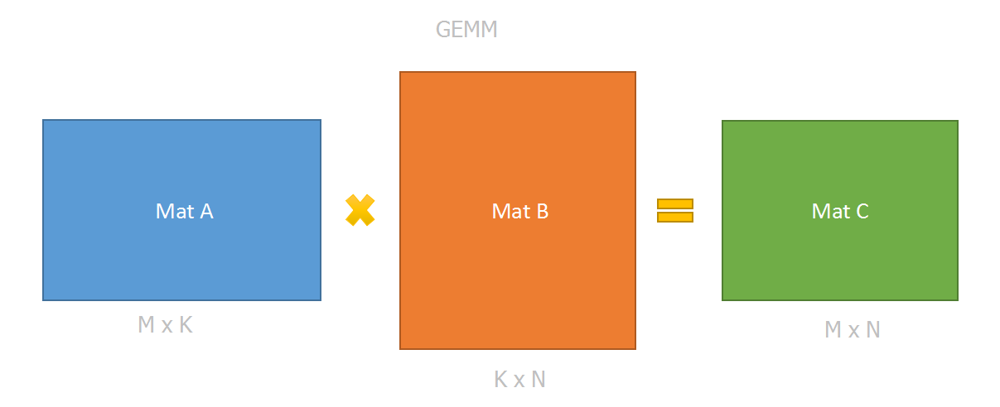
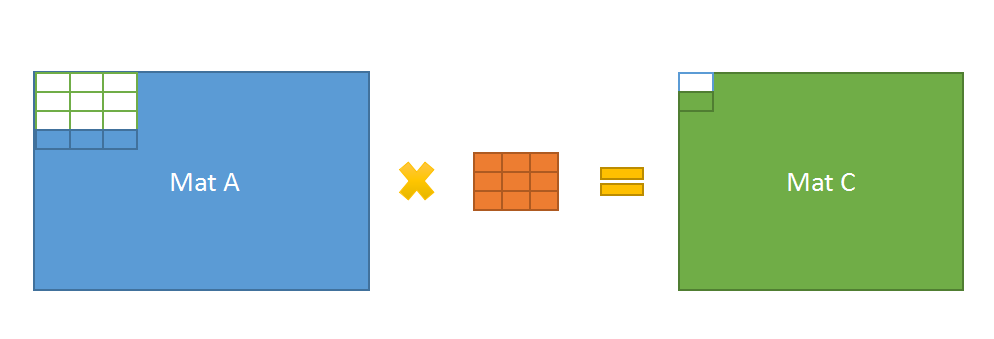
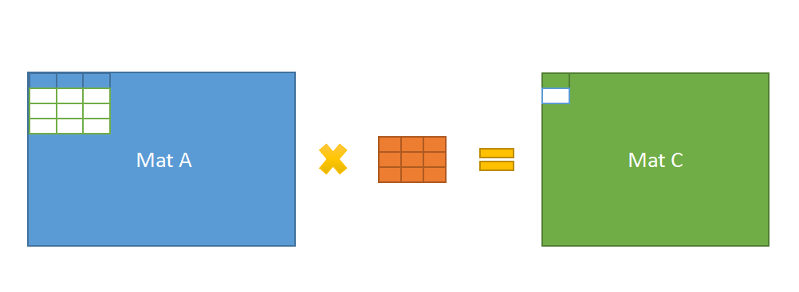

### ncnn

[ncnn](https://github.com/Tencent/ncnn)是腾讯最近开放的一个专门针对移动设备（尤其是android）的开源深度学习前向框架。

其优点如下：

* 纯c/c++实现，无第三方依赖，库体积很小，部署方便；
* 针对arm做SIMD优化，采用OpenMP多核并行技术，速度快；
* 支持较多常见的layer；
* 框架非常简单容易理解，类似[caffe](https://github.com/BVLC/caffe)以及[EasyCNN](https://github.com/xylcbd/EasyCNN)，很容易扩展；
* 提供caffe、tensorflow等框架模型的转换；

注：只包含前向计算，因此无法进行训练，需要导入其他框架训练好的模型参数。


### 框架设计

在看到一个库之前，一般喜欢先翻一下目录。ncnn的目录还是比较清晰简单的：

* ./
  顶层目录包含LICENSE，README，CMakeLists以及android、iOS的编译配置。

* ./examples/
  该目录下包含一个使用squeezenet做图像分类的c++例子程序，android例子程序，以及squeezenet模型文件。就喜欢这样的！啥都不用管就能跑起来。

* ./src/
  1. 目录顶层下是一些基础代码，如宏定义，平台检测，mat数据结构，layer定义，blob定义，net定义等。  
  2. ./src/layer下是所有的layer定义代码
  3. ./src/layer/arm是arm下的计算加速的layer
  4. ./src/layer/x86是x86下的计算加速的layer。

* ./tools/

  该目录是ncnn转换caffe、tensorflow模型的工具代码。

框架设计与caffe、EasyCNN基本类似，以Blob存储数据，以Layer作为计算单元，以Network作为调度单元。  

与前2者稍有不同的是ncnn中还有一个Extractor的概念，Extractor可以看做是Network对用户的接口。Network一般单模型只需要一个实例，而Extractor可以有多个实例。这样做的好处是进行多个任务的时候可以节省内存（模型定义模型参数等不需要产生多个拷贝）。


### 计算优化

​	计算主要采用OpenMP多核加速，优化CPU高速缓存读取，以及SIMD指令加速。

 *  OpenMP

    [OpenMP](https://zh.wikipedia.org/wiki/OpenMP)是一套跨平台的共享内存方式的多线程并发编程API，在大部分平台中都有实现，包括Windows，linux，android，iOS等。

    使用OpenMP加速只需要在串行代码中添加编译指令以及少量API即可。

    如下是一个向量相加的函数（串行）：

    ```c++
    void add(const int* a, const int* b, int* c, const int len)
    {
      for(int i=0; i<len; i++)
      {
        c = a[i] + b[i];
      }
    }
    ```

    改成OpenMP多核加速（并行）：

    ```c++
    #pragma omp parallel for
    void add(const int* a, const int* b, int* c, const int len)
    {
      for(int i=0; i<len; i++)
      {
        c = a[i] + b[i];
      }
    }
    ```

    理想情况下，加速比大约能达到0.75*cores。

* 缓存

  缓存对于高速计算是非常重要的一环，通过合理的安排内存读写，能非常有效的加速计算。

  如下面代码的gemm计算。

  

  ```c++
  static void gemm_v1(float* matA, float* matB, float* matC, const int M, const int N, const int K, const int strideA, const int strideB, const int strideC)
  {
  	for (int i = 0; i < N; i++)
  	{
  		for (int j = 0; j < M; j++)
  		{
  			float sum = 0.0f;
  			for (int k = 0; k < K; k++)
  			{
  				sum += matA[j*strideA + k] * matB[k*strideB + i];
  			}
  			matC[j*strideC + i] = sum;
  		}
  	}
  }
  ```

  ```c++
  static void gemm_v2(float* matA, float* matB, float* matC, const int M, const int N, const int K, const int strideA, const int strideB, const int strideC)
  {
  	for (int i = 0; i < M; i++)
  	{
  		for (int j = 0; j < N; j++)
  		{
  			float sum = 0.0f;
  			for (int k = 0; k < K; k++)
  			{
  				sum += matA[i*strideA + k] * matB[k*strideB + j];
  			}
  			matC[i*strideC + j] = sum;
  		}
  	}
  }
  ```

  gemm_v1比gemm_v2速度会慢很多，尤其是数据量比较大的时候。因为在gemm_v1中，matB和matC的访存以列为方向，会出现很多cache不命中的情况。而在gemm_v2中则只有matB发生较多cache不命中，而这是gemm计算无法避免的。

  在ncnn中，以卷积计算conv3x3_s1为例，每次从matA同时访问4行（一般一次3x3卷积只需要访问3行），由于step是1，所以可以同时生成2行的convolution结果。可以看到有2行数据直接共用了，缓存利用率得到极大提高。

  

  

* SIMD

  SIMD即单指令多数据指令，目前在x86平台下有MMX/SSE/AVX系列指令，arm平台下有NEON指令。一般SIMD指令通过intrinsics或者汇编实现。

  参考：[neon指令](http://hongbomin.com/2016/05/13/arm_neon_introduction/)

### 内存优化

​	主要通过分析依赖关系，使用引用计数的方法防止生成多份重复数据，利用这种方式节约内存，同时由于没有过多的抽象，因此能将内存使用控制到最低。


### 总结

ncnn框架简单高效，推荐使用。
