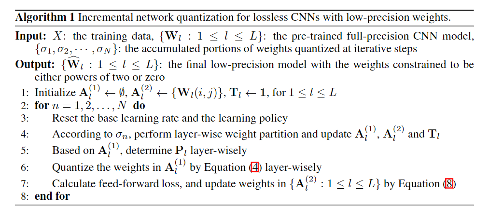
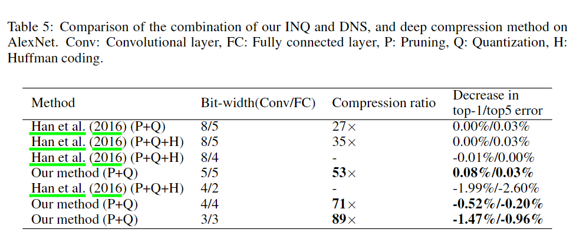

论文地址：[Incremental Network Quantization: Towards Lossless CNNs with Low-Precision Weights](https://arxiv.org/abs/1702.03044)  

这篇论文是Intel实验室发表的，提出了一种新的模型参数量化方案。结合[Dynamic Network Surgery for Efficient DNNs](https://arxiv.org/abs/1608.04493)中提出的模型压缩方法，可以做到在不产生精度损失（甚至略有提升）的基础上模型参数量化到3-5bit，且模型二进制大小压缩倍数达97倍。对于嵌入式设备（如手机），这类模型量化压缩方法作用比较明显。  

论文的主要创新点在于，不同于之前的一锅炖的量化方法，这篇论文中的量化会选择一部分进行量化，其他未量化的参数进行fine-tune以保证总体的精度不会下降太多（甚至略有提升）。

该篇论文的主要流程如下：
0. 设置超参数：包括量化bit数，参数选择步骤；
1. 选择一部分参数作为将要量化的参数集合，另外一部分参数仍保持原状；
2. 量化参数到0或者2的倍数（n1到n2倍）；
3. 训练若干个epoch：前向传播，反向传播，更新参数（只更新未量化参数）；
4. 循环1-3步骤，直到所有参数全部量化完成。

量化参数的选择有2种方法：
1. 随机分组；
2. 按照参数绝对值进行分组。
实验结果是第2中参数挑选策略比第1种要好，原因在于绝对值较大的参数对于网络的贡献相比绝对值较小的参数贡献更大。

最后作者在AlexNet、VGG-16、GoogleNet、ResNet-18、ResNet-50等网络中均进行了测试，证明该方法的普适性。

在AlexNet上的测试结果：

