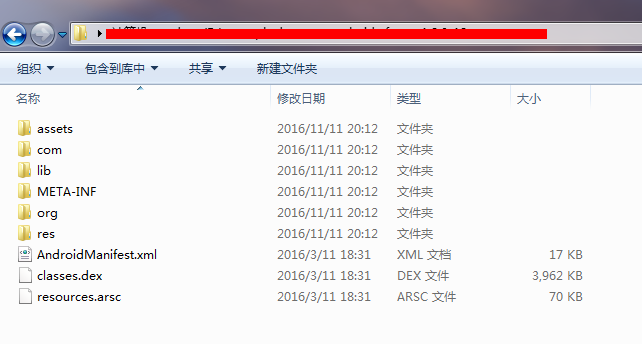
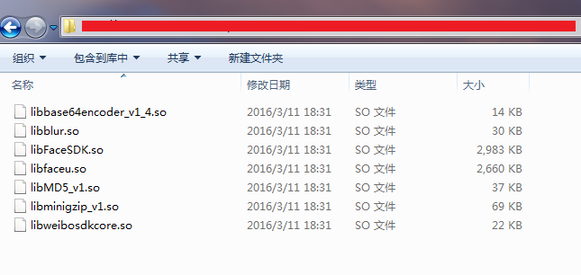
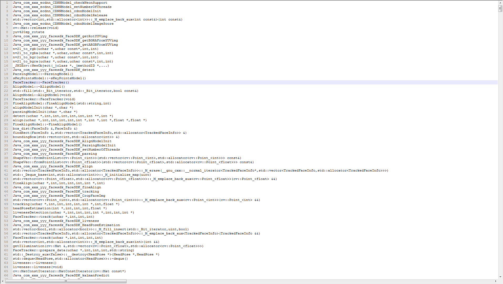
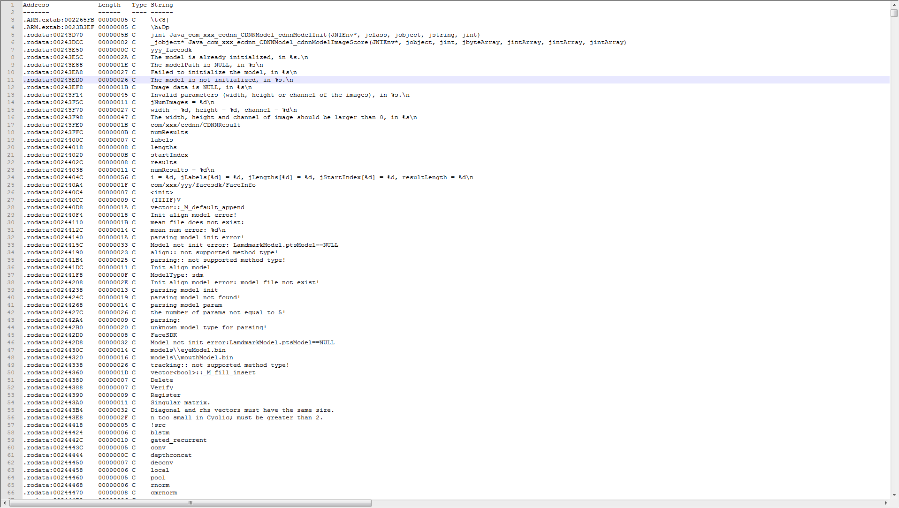
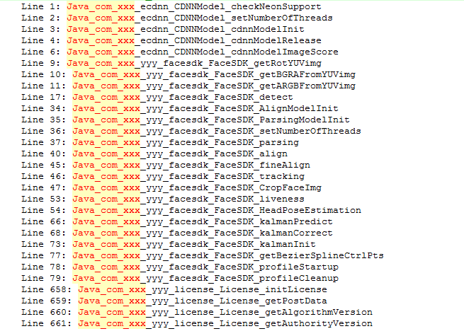
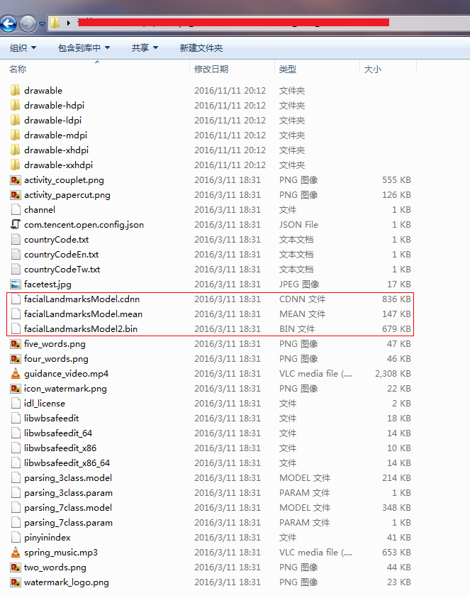

## 前言
在[之前一篇文章](http://hongbomin.com/2016/06/24/how-to-hide-symbols-of-c-functions/)中，介绍了动态库符号的隐藏方法。  
这篇文章会向你展示通过软件的发行包你能知道什么？以及如何防止算法细节泄露。

## 工具
IDA Pro

## 目标
某厂的人脸检测与变形的Android APK。

## 分析
* 首先下载安装好IDA Pro和目标APK。
* 解压APK，Zip解压即可。
APK目录结构如下：  

* 进入lib目录，观察动态库
lib目录如下：  
  
可以看出libFaceSDK.so是人脸检测的关键动态库，用IDA Pro打开它，IDA Pro在左侧窗口给出函数符号的分析结果。  
函数符号全部复制到notepad++中[1]，如下图：
  
打开IDA Pro菜单/view/Open views/Strings，可以发现动态库中用到的字符串全部可以看到，同样复制到notepad++中[2]，如下图：
  
分析函数符号，首先搜索JNI函数入口“Java_com”，找到如下函数：  
   
再分析函数符号和字符串，很容易发现这个人脸SDK采用的是CNN深度学习来做的，并且有一个叫做ecdnn的深度学习框架（可能只包含前向传播，不含训练）。

* 进入assets目录，观察资源文件。  
资源文件目录如下图：
   
很容易想到，其中的facialLandmarksModel.cdnn以及facialLandmarksModel2.bin是模型文件，而facialLandmarksModel.mean是CNN均值图片文件。  
均值文件其大小是150528，一般CNN要么用灰度图要么用RGB3通道，且一般都是正方形图，150528不是某个值的平方，将其除以3得到50176，正好是224x224，而224x224是经典的vgg网络的输入大小，由此可知该网络模型应该是在vgg网络或者类似网络上上fine-tune而来。  
然后根据模型文件的大小，也可以基本估计出其网络层数不会很深。

## 结论
如何保护软件发型的二进制包，以防止算法细节被竞争对手知晓，需要细心的检查和测试，依据[之前一篇文章](http://hongbomin.com/2016/06/24/how-to-hide-symbols-of-c-functions/)中提到的函数符号和字符串隐藏的方法，再加上模型加密，基本可避免简单的分析手段。

## 附件
1. [symbols.txt](https://github.com/xylcbd/xylcbd.github.io/blob/master/2016/11/09/securiity-of-software/symbols.txt)
2. [strings.txt](https://github.com/xylcbd/xylcbd.github.io/blob/master/2016/11/09/securiity-of-software/lib_all_strings.txt)
