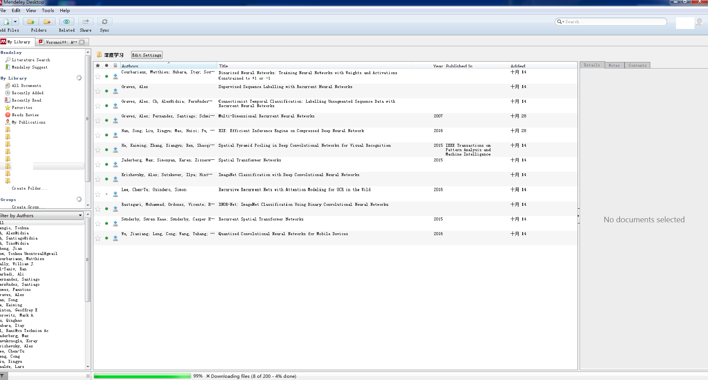
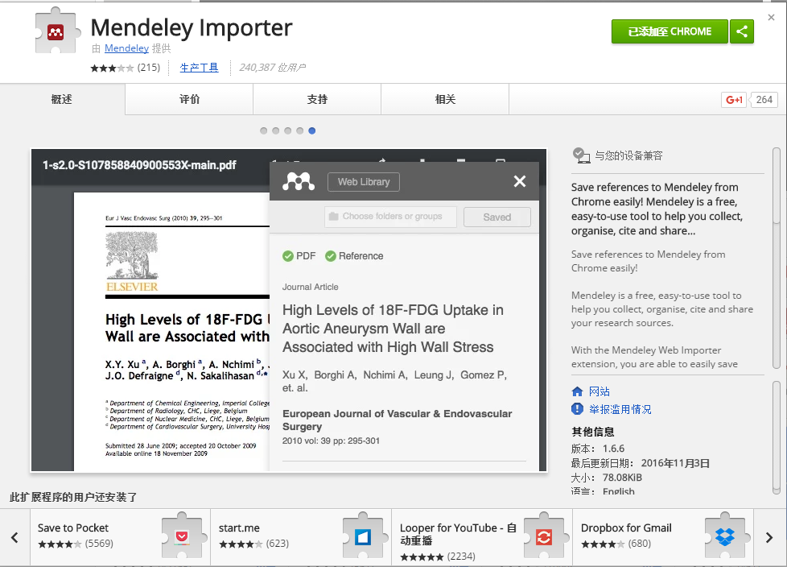
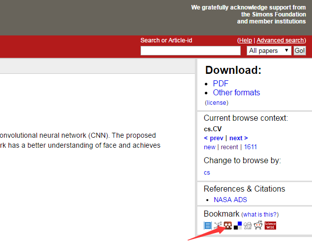
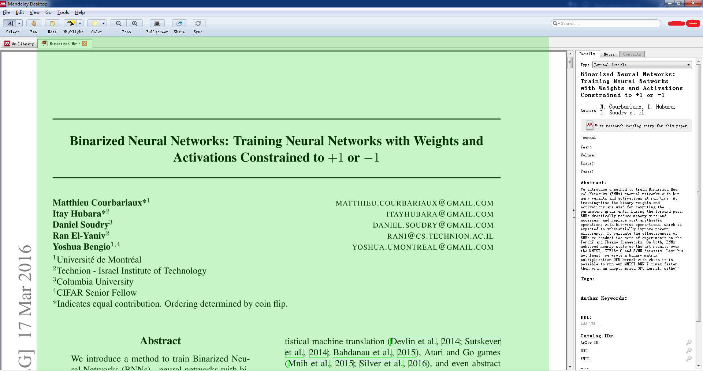

## 为什么需要文献管理工具
当我们需要某个方向的研究动态或者收集该方向的经典算法时，我们会下载不少论文作为基础知识储备。很多时候，需要对这些文献作检索，检索的维度包括：作者、时间、标题、出版社、摘要等等。  
土法管理的时候是这样的，在论文文件名中标明作者、时间、标题等等，摘要和题注则单独用个小本本记起来，用到的时候再打开搜索。这种方法麻烦又低效，过不了多久懒虫发作就不愿再填了（和小时候发下每天记日记的宏愿一样不了了之:)）。  
所以，需要一个便捷高效的主搜索性质的文献管理工具。这里解释一下为什么应该是主搜索的，对比下早期雅虎和google的成败就知道，细致的分类是吃力不讨好的，关键字搜索才是王道。文献的检索和网页检索没有什么不同，最快建立索引最快能查到所需要的信息才是最重要的，因此文献管理工具必须具有很好的搜索功能。  
体验了几个知名的，最终选定Mendely了~

## Mendely长什么样
[Mendely](https://www.mendeley.com/) 是一款免费的文献管理工具，支持多平台，包括web端、windows、iOS等主流平台。Mendely的windows客户端首页如下（其他平台界面类似），功能区一目了然，就不多置喙：  
  

## Mendely的优点
* 跨平台
> 1. 常见平台中都可以安装使用Mendely客户端，即使无法使用客户端亦可以直接使用网页端（功能基本无影响）  
> 2. 文献笔记以及PDF标记等在多平台共享使用，与PDF本身脱钩作为元信息存储在服务器中。

* 导入文献方便
 > 1. Mendely的windows客户端，本地PDF可直接拖入到主界面中即可导入并上传到服务器。  
 > 2. Mendely还提供chrome的导入插件，在chrome中打开的pdf可直接导入到Mendely空间中。
   
 > 3. Mendely在一些主要的文献站点有合作，可以在文献所在页面导入到Mendely空间，如[arxiv](https://arxiv.org)：
 

* 检索方便
> 可基于多维度进行检索。

* 个性化推荐
> Mendely根据用户已有的文献会个性化推送一些可能感兴趣的文献，且包含对该文献感兴趣的人数等信息，有时候能发现不少惊喜。

## Mendely的缺点
 * 访问速度较慢
 > 服务器在国外，所以...

 * PDF阅读体验不够好
 > 内置的PDF阅读器体验一般，我最在乎的替换背景色都没有:(，且没有取词翻译（英语渣哭）。  
 背景色的问题主要是护眼考虑，目前写了个[工具](https://github.com/xylcbd/ScreenCover)，工具功能很简单，把桌面部分区域用自定义透明度颜色的遮罩折起来（鼠标操作可穿透，类似于网易云音乐的桌面歌词），算是基本解决默认白色背景过去刺眼的问题。  
   
 至于取词翻译的问题，等以后看有时间有机会弄个工具不...

 ## Mendely，推荐啊
 总的来说，瑕不掩瑜，这个工具真心不错，推荐之。
