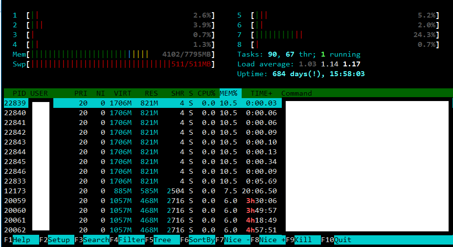

## 工具类
### htop
取代top，界面更加用户友好。


### ag
急速文件内容搜索。类似：
```shell 
find . -type f|xargs grep 'foo'
```

### seq
test.sh执行50次
```shell
seq 50|xargs -i ./test.sh
```

### ab
apache bench tool，用于测试http服务器性能。
```shell 
#测试5000次，并发200
ab -n 5000 -c 200 http://localhost/api/predict
```

### tac
与cat行为相反，从后往前输出。

---

## 命令类
### 批量杀死进程
```shell 
ps -ef|grep your_kill_target_name |grep -v 'grep'| awk '{print \$2}'|xargs kill -9
```

### 删除除最新文件以外的所有文件
```shell
#删除log目录下的所有旧文件
ls -alt log | tail -n +2 | awk 'BEGIN {FS=" "} NR > 3 {print \$NF}'|xargs -i rm -r log/{}
```

### 删除指定文件之外的其他所有文件
```shell
#删除当前目录下spec.file之外其他所有文件
rm -rf !(spec.file)
```

### 禁用GPU CUDA
```shell
CUDA_VISIBLE_DEVICES="" python train.py
```

### git clone with submodule
```shell 
git clone --recursive git://github.com/foo/bar.git
```

### 发送文件到远端系统
```shell
scp foo.bar user@remote:/data/
```

### 组合字符串
```shell
cat train.txt |xargs -i echo `pwd`/{} 0 >train.lst
```

---
待续...
---
