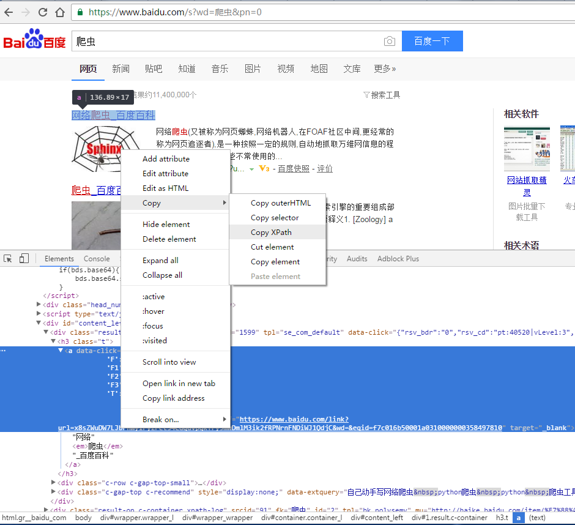
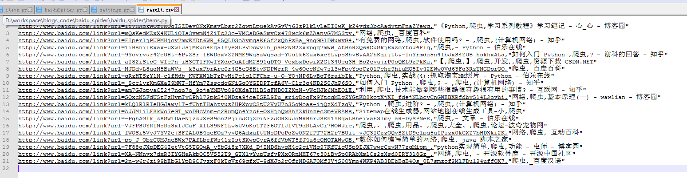

## 1. 爬虫是什么
爬虫（Spider），这里当然不是说结网捉虫的蜘蛛那样的生物学上的爬虫，这里说的是互联网上的爬虫，由程序员编写，具有一定的逻辑性能够完成在指定范围内进行信息收集的程序。  

据说爬虫占据了互联网上60%多的流量，可想而知这个无比庞大的互联网上有多少只辛辛苦苦矜矜业业的爬虫们啊。  

爬虫，主要分为搜索引擎类的爬虫和具有一定目标的专用爬虫。前者索引整个web世界，让人们能方便的搜索到自己想要的信息，一般网站也很欢迎这些爬虫。而后者有时候目的性比较强，爬取范围也比较窄，一般收集数据用于二次加工或者数据分析等。这里主要讲的就是第二种爬虫。

## 2. 爬虫怎么工作
爬虫的工作很简单，一句话概括就是找到目标入口然后在目标页面获取目标内容。

爬虫的原理也不复杂，主要是通过http或者其他协议，发送请求到目标接口，然后解析返回的内容成结构化数据存储到本地。  


## 3. 怎么制作爬虫
制作一个爬虫基本需要如下步骤：

> * 确定目标：  
制作爬虫首先需要清楚自己的目的，希望获取哪些信息。
> * 观察目标：  
然后通过观察目标网站或者程序，获取目标信息的入口和索引方式。
> * 结构提取：  
进入内容页面，观察感兴趣区域的页面结构，然后考虑通过正则表达式或者xpath等方式提取目标内容。
> * 编码实现：  
前3步完成之后，最后就是使用线程工具或者自己编码实现这个爬虫了。

完成这些，基本上就可以认为制作出来一个网络爬虫了，然后就是让这个爬虫启动运行起来。至于怎么处理爬到的数据，那就不是爬虫的事了。

下面介绍2种爬虫制作方法。

### 3.1 使用工具制作爬虫
由于爬虫这种需求比较多，所以网络上有一些专门的工具，能通过简单的配置就能制作爬虫。  

推荐一个国内软件商制作的比较傻瓜式的爬虫生成工具：[火车采集器](http://www.locoy.com/)，免费版基本就够用了。

具体用法参考其[视频教程](http://www.locoy.com/video)，基本上看完视频就能知道怎么用了。

这个对于一些简单的场景基本够用了，主要优势是配置简单，搭建方便，傻瓜化运行。

### 3.2 编写代码制作爬虫
在现有工具无法满足需求或者想要学习爬虫的原理的时候，也可以通过编写代码来制作爬虫。  

当然，也不需要要从tcp/ip或者http协议这么底层开始，可以通过一些开源的爬虫框架来编写爬虫。其中以python语言作为基础的爬虫框架比较多，这里以scrapy为例。  

[scrapy](https://scrapy.org/)是一个开源的python爬虫框架，也是目前最流行的爬虫框架之一，里面集成了一些爬虫常用的功能，基本上只需要写爬虫的逻辑就行。

---

以一个最简单的例子来说明scrapy的用法。

#### 3.2.1 确定目标
需要有一个爬虫每天去查询百度搜索“爬虫”的前2页搜索结果，然后分析新排序到前2页的搜索结果（其他后处理）。

#### 3.2.2 观察目标
首先在百度输入“爬虫”搜索，跳转到搜索结果页。观察结果页面的URL结果，可以看到：  
* 第1页URL：
> https://www.baidu.com/s?ie=utf-8&f=8&rsv_bp=1&tn=baidu&wd=%E7%88%AC%E8%99%AB&oq=%E7%88%AC%E8%99%AB&rsv_pq=9fd63f8600011b0b&rsv_t=3b30%2BHymEU5wSsRM5DGZD1gCwRjvljkpEIr3hXU0nOba6AHvpIdgH6DokZ4&rqlang=cn&rsv_enter=0&rsv_sug3=1&rsv_sug1=1&rsv_sug7=100&rsv_sug4=470
* 第2页URL：
> https://www.baidu.com/s?wd=%E7%88%AC%E8%99%AB&pn=10&oq=%E7%88%AC%E8%99%AB&ie=utf-8&usm=1&rsv_pq=cb75075a0001681d&rsv_t=0986khHCUHLdfml7ymZib2JecfTLlPX%2Ft57JycxSQwzQh5miPsj1IKCeEGQ&rsv_page=1

URL里面有不少参数，可能用不着，所以试着简化这个URL：  
* 第1页URL：
> https://www.baidu.com/s?wd=爬虫&pn=0  
* 第2页URL：
> https://www.baidu.com/s?wd=爬虫&pn=10

那么爬虫的入口就知道了。

#### 3.2.3 结构提取
scrapy用的是xpath做结构解析，所以这里需要获取到目标区域的xpath。xpath是什么参考[这里](http://www.w3school.com.cn/xpath/)。

chrome浏览器有一个很好的插件可以很方便的获取到某个html节点的xpath，[XPath Helper](https://chrome.google.com/webstore/detail/xpath-helper/hgimnogjllphhhkhlmebbmlgjoejdpjl?hl=en)，先安装好它。  

打开chrome，输入URL（https://www.baidu.com/s?wd=爬虫&pn=0），然后F12进入开发者模式。通过鼠标找到第1个搜索结果的html节点，然后右键：copy-Copy XPath。  


得到搜索结果html节点的xpath分别是：
```
第1页1-10搜索结果：
//*[@id="1"]/h3/a
//*[@id="2"]/h3/a
...
//*[@id="10"]/h3/a
第2页11-20搜索结果：
//*[@id="11"]/h3/a
//*[@id="12"]/h3/a
...
//*[@id="20"]/h3/a
```

那么目标区域的xpath就很明显了，获取到xpath之后得到href属性和text结果就行了。  

当然也可以通过其他的xpath获取到这些节点位置，这个并不是唯一的。

#### 3.2.4 编码实现
scrapy安装这里不再赘述，通过pip install scrapy即可安装，国内可以把pip的源设置为阿里云或者豆瓣的源，然后执行上述命令安装。  

本节全部代码在：[baidu_spider](https://github.com/xylcbd/blogs_code/tree/master/baidu_spider)  

进入工作目录，命令行输入：
```sh
scrapy startproject baidu_spider
```
然后进入baidu_spider目录，打开items.py，输入如下代码：
```python
# -*- coding: utf-8 -*-
import scrapy

class BaiduSpiderItem(scrapy.Item):
    # define the fields for your item here
    #搜索结果的标题
    title = scrapy.Field()
    #搜索结果的url
    url = scrapy.Field()
```
这里定义的是爬虫爬取结果的结构，包含搜索结果的标题和搜索结果的url。  

打开settings.py，修改下面行：
```python
#ROBOTSTXT_OBEY = True
ROBOTSTXT_OBEY = False
```
这个修改是因为百度的robots.txt禁止其他爬虫去爬它，所以需要把robots协议这个君子协定暂时单方面关掉。

然后进入spider目录，新建baiduSpider.py，输入下面代码：
```python
# -*- coding: UTF-8 -*-
import scrapy
from scrapy.spiders import CrawlSpider
from scrapy.selector import Selector
from scrapy.http import Request
from baidu_spider.items import BaiduSpiderItem
from selenium import webdriver
import time

class BaiduSpider(CrawlSpider):
    name='baidu_spider'

    def start_requests(self):
        #函数名不可更改，此函数定义了爬虫的入口地址
        #使用浏览器访问
        self.browser = webdriver.Chrome('d:/software/chromedriver.exe')
        for i in range(0,20,10):
            url = 'https://www.baidu.com/s?wd=爬虫&pn=%d' % i
            yield self.make_requests_from_url(url)

    def parse(self, response):
        #函数名不可更改，此函数定义了爬虫的页面解析
        #打开浏览器访问页面
        self.browser.get(response.url)
        time.sleep(1)
        selector = Selector(text=self.browser.page_source)
        page_start = int(response.url.split('=')[-1])

        for i in range(1,11):
            item = BaiduSpiderItem()        
            xpath = '//*[@id="%d"]/h3/a' % (page_start+i)      
            print xpath
            print selector.xpath(xpath + '/@href').extract()
            item['url'] = selector.xpath(xpath + '/@href').extract()[0]           
            item['title'] = selector.xpath(xpath + '//text()').extract()           
            yield item
```
这里用到了selenium和chrome webdriver，用于使用chrome模拟正常用户的访问，这是因为百度做了防爬虫的措施，所以为了简单，我们就假装我们的爬虫就是正常用户。  

selenium通过pip安装即可，chrome webdriver在[]此处](https://sites.google.com/a/chromium.org/chromedriver/downloads)下载，然后安装上。把baiduSpider.py中的webdriver.Chrome行中的可执行文件地址改成自己的安装地址。

全部代码编写完毕，在scrapy.cfg那一层目录（顶层）中输入下面的命令启动爬虫：
```shell
scrapy crawl baidu_spider -o result.csv
```
一切顺利的话会输出一些log，并且启动chrome打开网页，最后生成result.csv文件，文件内包含了爬取到的结果。



本节全部代码在：[baidu_spider](https://github.com/xylcbd/blogs_code/tree/master/baidu_spider)  

### 4. 爬虫进阶
爬虫的进阶就是需要与数据来源方斗智斗勇了，处理包括但不限于以下问题：
> * IP被封禁
> * 访问次数受限制
> * 爬取速度太慢
> * 页面重定向
> * 页面ajax生成内容
> * 页面内容由复杂的javascript生成
> * etc.
