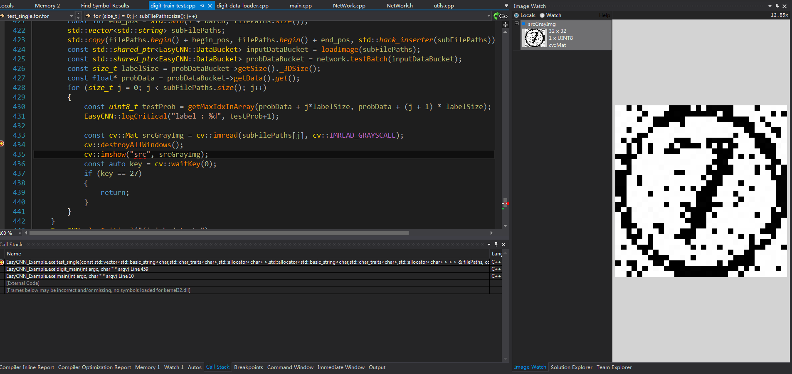
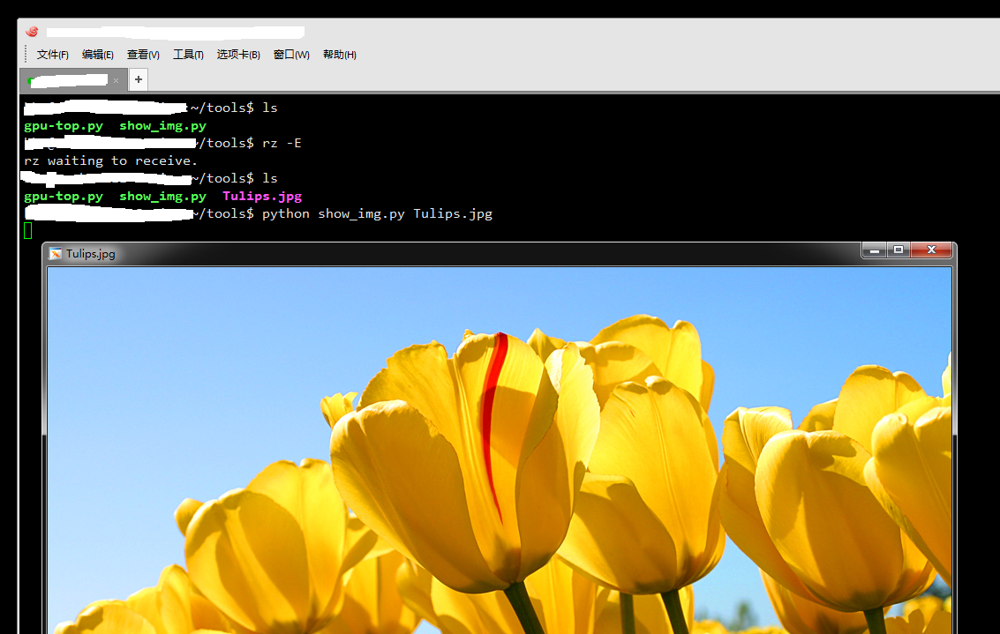

个人偏好在windows下进行开发，结合visual studio和notepad++，能非常高效的进行c++和python的编程开发。

在windows中，使用Visual Studio结合[Image Watch插件](https://marketplace.visualstudio.com/items?itemName=WolfKienzle.ImageWatch)，能非常方便的进行图像处理的调试。
效果如下：
  

而在通过xshell登录linux终端进行开发调试的时候，无法直观的看到图像，总是需要下载图片到本地进行查看，非常麻烦，因此写了个小脚本，结合xshell，能非常方便的查看linux服务器上的图片。

脚本代码非常简单：
```python
!/usr/bin/python
# -*- coding:utf-8 -*-  
import os
import sys
import cv2

def main_proc(img_path):
    img = cv2.imread(img_path)
    if img is None:
        print 'invalidate image: '+img_path
        return
    cv2.imshow(img_path,img)
    cv2.waitKey(0)

if __name__ == '__main__' :
    if len(sys.argv) != 2:
        print("usage\n\t"+sys.argv[0]+" image_path")
        sys.exit(0)
    main_proc(sys.argv[1])
```

在使用脚本之前，需要安装libgtk2.0-dev和opencv包，Ubuntu下安装方法：
```shell
#libgtk
sudo apt-get install libgtk2.0-dev
#opencv
git clone https://github.com/Itseez/opencv.git && cd opencv && mkdir build && cd build && cmake -DCMAKE_BUILD_TYPE=RELEASE -DWITH_GTK=ON -D BUILD_NEW_PYTHON_SUPPORT=ON .. && make && sudo make install
```

使用方法，脚本另存为show_image.py，然后在xshell命令窗口中输入：python show_image.py test.png，即可在windows端看到xshell产生的图片窗口。


在其他脚本中使用OpenCV的cv2.imshow也能看到弹出窗口显示图像，甚至能转发鼠标事件。
