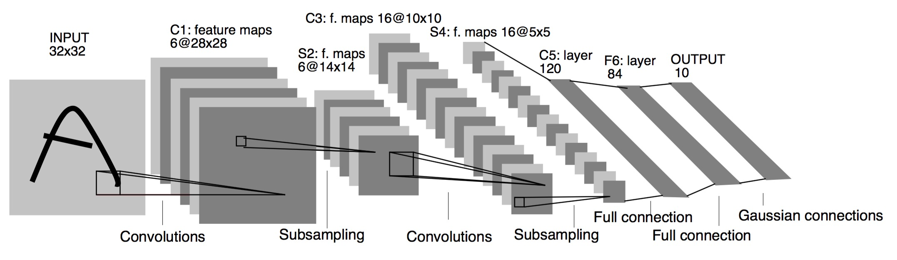
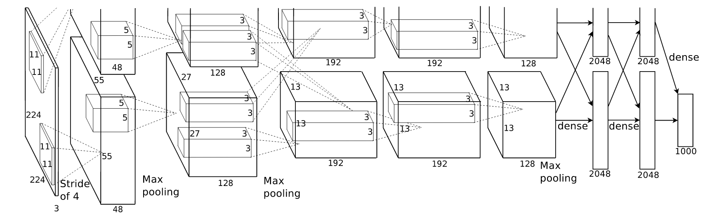
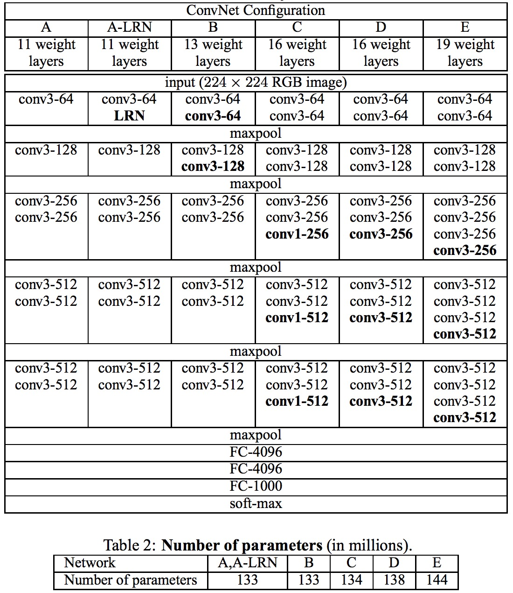
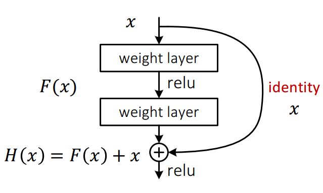

经典模型巡礼，包含最经典的以及最先进的模型和结构。

深度学习经典模型巡礼，包含最经典的以及最先进的模型和结构。

### 经典模型

#### LeNet-5

LeNet-5几乎是所有深度学习初学者的hello world模型。它是深度学习领域祖师级别人物Yann LeCun在1998年设计的用于手写数字识别的CNN模型。

#### AlexNet

AlexNet诞生于2012年，借助大规模数据集和高性能GPU，它轻而易举的打败了传统模型，并使得深度学习进入学术界工业界视野，可称得上是深度学习第一个非常成功的模型。

#### VGGNet

VGGNet与AlexNet网络结构差异不大，只是VGGNet用的基本都是3x3的小卷积核，并且深度更深，相比AlexNet的8层，VGGNet达到19层。

#### GoogleNet

GoogleNet又称InceptionNet，目前已经更新到InceptionNet v4。其主要创新在于引入1x1 conv并且组合1x1，3x3，5x5的卷积核。

#### ResNet

ResNet最大的创新在于一下子把网络提升到特别深，并且证明，几乎是网络越深效果越好。网络这么深仍能够训练的诀窍在于残差的跳层传递，如下图。

#### SqueezeNet

#### Fast-RCNN

#### Faster-RCNN

#### YOLO

#### SSD

#### MobileNet

### 经典结构

#### CNN

#### RNN

#### LSTM

#### GRU

#### SRU

